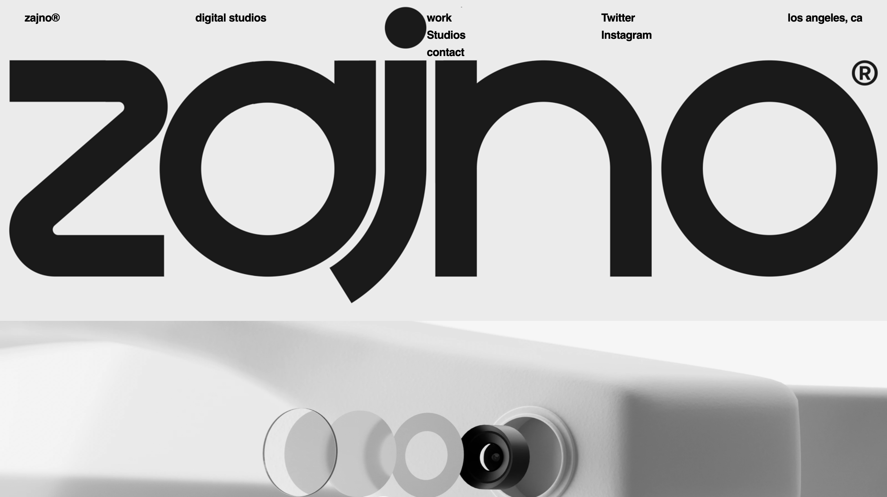

# 🚀 Interactive Image Distortion with Three.js & GSAP  

An experimental **WebGL** project that combines **Locomotive Scroll, Three.js, and GSAP** to create smooth-scrolling, interactive image distortion effects using custom shaders.  

## ✨ Features  
✅ **Smooth Scrolling** – Powered by **Locomotive Scroll** for a seamless experience.  
✅ **WebGL Image Distortion** – Uses **Three.js ShaderMaterial** for hover effects.  
✅ **Interactive Mouse Effects** – Real-time **GSAP animations**.  
✅ **Raycasting for Interaction** – Detects hover events and applies dynamic distortions.  
✅ **Responsive Handling** – Updates positions on window resize.  

## 🛠️ Technologies Used  
- **Three.js** – WebGL-based 3D rendering  
- **GSAP** – Smooth animations  
- **Locomotive Scroll** – Enhanced scrolling effects  
- **WebGL Shaders** – Custom vertex & fragment shaders  

## 📂 Installation  
1. Clone the repository:  
   ```bash
   git clone https://github.com/your-username/repository-name.git
   cd repository-name
   

